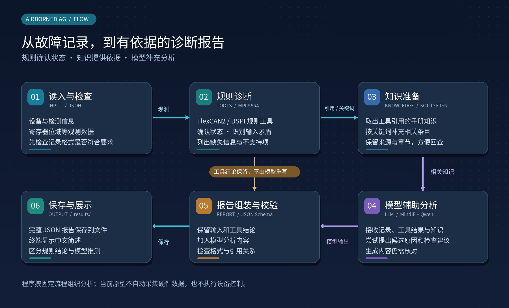

# AirborneDiag

[项目介绍](#项目介绍) · [核心功能](#核心功能) · [原理](#原理) · [快速开始](#快速开始) · [使用说明](#使用说明) · [技术栈](#技术栈) · [文档导航](#文档导航)

## 项目介绍

AirborneDiag 是面向民机机载设备的故障诊断原型。当控制器设备上电自检失败或通信异常时，它接收一份记录了检测结果、寄存器状态等信息的 JSON 文件，结合芯片手册中的知识和预先编写的诊断规则，分析当前能确认什么、还缺什么信息，并调用大模型尝试补充可能原因和检查建议。例如，接收到设备上电自检的 CAN 通信自检失败信息后，AirborneDiag 可以进一步分析记录中的寄存器位域，判断是否处于总线关闭状态、哪些信息不足以支持判断，并把结论与依据一起写进报告。

当前版本支持**MPC5554 的 FlexCAN2 和 DSPI 部分场景**，提供命令行入口和10条模拟案例，用于验证诊断流程。

## 核心功能

| 功能 | 可以做什么 |
|---|---|
| 故障记录检查 | 检查输入文件的字段、类型和格式是否符合约定，及时指出不合规内容。 |
| 规则诊断 | 分析已解码的寄存器位域，列出确认状态、输入矛盾、缺失信息和当前不支持的内容。 |
| 知识检索 | 从整理好的芯片手册知识中查找相关条目，保留来源与章节，方便回查。 |
| 模型辅助分析 | 将记录、工具结论和相关知识交给模型，尝试生成候选原因与检查建议。 |
| 报告保存与展示 | 保存完整 JSON 报告，在终端显示中文简述，方便查看与留档。 |
| 分步使用 | 既可以一条命令生成报告，也可以单独运行规则诊断、知识查询或模型连通性检查。 |

## 原理



一次完整分析由程序按固定顺序组织：

1. **读入记录。** 检查 JSON 格式，确认设备、检测项目和观测数据符合输入要求。
2. **运行工具。** 根据芯片与外设选择诊断规则，判断哪些状态可以确认、哪些信息存在矛盾或缺失。
3. **准备知识。** 取出工具结论引用的知识条目，再通过关键词检索补充相关内容。
4. **调用模型。** 将原始记录、工具结果和知识一起发送给 MindIE，由模型生成候选原因和检查建议。
5. **生成报告。** 程序保留工具结论，加入模型输出，检查报告格式和引用关系，通过后保存并显示简述。

**工具负责按规则判断，模型负责补充分析，程序负责组织流程与生成报告。**

知识来自事先整理的 `knowledge/curated/` 文件。

## 快速开始

以下步骤从**工程根目录**执行。先准备 Python 环境；生成完整报告还需要一个已经启动、能够访问的 MindIE 服务。

### 1. 安装项目

项目声明支持 Python 3.9 及以上，现有验证基线为 Python 3.9；知识检索需要 Python 自带的 SQLite 支持 FTS5。模型权重及 MindIE 不随本项目安装。

**Windows PowerShell：**

```powershell
python -m venv .venv
.\.venv\Scripts\python.exe -m pip install -e ".[dev]"
```

**Linux：**

```bash
python3 -m venv .venv
.venv/bin/python -m pip install -e ".[dev]"
```

上面的安装命令需要联网。板端无法联网时，按 [开发与部署说明](docs/development.md) 准备对应平台的 `wheelhouse/`，使用离线安装步骤。

下面用 Windows PowerShell 演示；Linux 下将 `.\.venv\Scripts\airbornediag.exe` 换为 `.venv/bin/airbornediag` 即可。

### 2. 配置模型服务

首次配置时，将 `.env.example` 复制为工程根目录下的 `.env`，按实际服务修改：

```dotenv
AIRBORNEDIAG_LLM_BASE_URL=http://127.0.0.1:1025
AIRBORNEDIAG_LLM_MODEL=Qwen2.5-1.5B
```

服务地址不包含 `/generate`；模型名应与 MindIE 中的 `modelName` 一致。`127.0.0.1` 表示运行命令的这台机器，只有服务在本机或已建立端口转发时才使用这个地址；通过网络直连时填写板端 IP。

先发送一句话，检查服务是否可用：

```powershell
.\.venv\Scripts\airbornediag.exe llm --prompt "你好，请用一句话介绍自己。"
```

### 3. 构建知识索引

```powershell
.\.venv\Scripts\airbornediag.exe kb build
```

程序读取已整理的知识，生成本地索引 `knowledge/index/knowledge.sqlite3`。首次使用、更新知识文件或换到另一台机器后，执行一次即可。

### 4. 生成第一份报告

```powershell
.\.venv\Scripts\airbornediag.exe report examples/REC-2026-0918-002.json
```

成功后，终端会显示中文简述和保存位置，完整报告位于：

```text
results/RPT-2026-0918-002_<运行时间>.json
```

`results/` 不存在时自动创建，默认生成的同名文件会追加序号，避免覆盖。用 VS Code 或其他文本编辑器打开 JSON 文件即可查看完整内容。

**暂时没有模型服务？** 可以先体验不依赖模型和知识索引的规则诊断：

```powershell
.\.venv\Scripts\airbornediag.exe diag examples/REC-2026-0918-002.json
```

## 使用说明

### 根据需要选择命令

| 命令 | 用途 | 是否需要模型服务 |
|---|---|---|
| `diag` | 只运行规则诊断，查看状态、矛盾及缺失信息 | 否 |
| `kb build` | 构建或重建本地知识索引 | 否 |
| `kb query` | 查询知识条目 | 否 |
| `llm` | 发送一段文字，检查模型调用 | 是 |
| `report` | 运行完整流程，保存报告并显示简述 | 是 |

以下示例假定已激活虚拟环境：Windows PowerShell 执行 `.\.venv\Scripts\Activate.ps1`，Linux 执行 `source .venv/bin/activate`。如果 PowerShell 阻止激活脚本，直接使用快速开始中的完整命令路径即可。

```bash
# 只看规则诊断结果；加 --json 可输出结构化结果
airbornediag diag examples/REC-2026-0918-002.json --json

# 查询知识，或限定芯片和外设
airbornediag kb query "总线关闭"
airbornediag kb query "TFUF" --chip MPC5554 --peripheral DSPI --limit 3

# 指定报告保存位置
airbornediag report examples/REC-2026-0918-002.json --out report.json

# 查看完整参数
airbornediag report --help
```

指定 `--out` 后只保存到该路径，文件已存在则覆盖，父目录需要提前建立。默认路径均相对当前工作目录，因此建议始终在工程根目录执行。

### 输入文件怎么准备

可以先复制 `examples/` 中与目标场景接近的 JSON，再按自己的记录修改。输入主要包含：

| 内容 | 含义 |
|---|---|
| 设备信息 | 被诊断的芯片型号，例如 MPC5554 |
| 检测信息 | 哪个模块做了什么检测，结果是什么 |
| 观测信息 | 实际采集到的寄存器位域、采集时刻及相关记录 |
| 数据来源 | 区分模拟案例与真实采集的数据 |

例如，`CAN_B.ESR` 中的 `FLTCONF` 表示该实例的一个状态位域。当前规则使用已解码的 `fields`，尚不支持直接将寄存器十六进制原始值转换成位域；没有提供的数据不能填成 0 来代替未知。完整格式见 [输入输出说明](docs/contracts.md)，现有案例及其含义见 [场景说明](docs/scenarios.md)。

### 报告怎么看

先看“故障状态”和“根因判定”，再看下面各部分：

| 报告内容 | 来源 | 阅读方法 |
|---|---|---|
| 确认状态 | 规则工具 | 当前观测能支持的状态结论；确认某种状态不一定代表故障。 |
| 输入矛盾 | 规则工具 | 哪些数据或标注相互冲突，需要先澄清。 |
| 缺失信息 | 规则工具 | 当前判定还需要什么数据；列表为空也不代表信息完全齐全。 |
| 不支持 | 规则工具 | 有数据，但本版还没有对应的分析能力。 |
| 候选原因 | 模型 | 可能的解释，仍需要验证。 |
| 检查建议 | 模型 | 建议下一步检查什么，需要判断是否合理、可执行。 |

例如，报告可以同时显示“故障状态：已确认”和“根因判定：未确定”：这表示已经发现了符合判据的故障状态，但还不知道是什么导致的。

## 技术栈

| 技术 | 在项目中的作用 |
|---|---|
| Python | 实现命令行、诊断工具与整体处理流程 |
| JSON / JSON Schema / jsonschema | 定义故障记录和报告的结构，并执行格式校验 |
| SQLite FTS5 | 对本地知识建立全文索引，按关键词查询，无需单独运行数据库服务 |
| MindIE | 提供 HTTP 推理服务，接收模型请求并返回回答 |
| Qwen2.5-1.5B-Instruct | 当前接入的模型，用于生成候选原因与检查建议 |
| pytest / GitHub Actions | 自动化测试与 PR 持续集成检查 |
| GitHub Issues / Projects / Pull Requests | 跟踪任务、管理进度与审查变更 |

**应用与模型服务分开部署。** AirborneDiag 可以在 PC 上运行，通过网络调用智能平台上的 MindIE；也可以将应用放到智能平台上运行。知识文件、SQLite 索引和生成的报告都保存在运行 AirborneDiag 的机器上，MindIE 负责模型推理。

当前使用的智能平台厂家型号为 **RDC300I-A2**。Docker、CANN 和模型权重由推理环境管理，不属于 AirborneDiag 的 Python 安装依赖。

## 文档导航

| 想了解什么 | 去哪里看 |
|---|---|
| 如何安装、离线部署、配置服务和排查运行问题 | [开发与部署说明](docs/development.md) |
| 模块如何分工，数据如何流转 | [架构说明](docs/architecture.md) |
| 输入 JSON 怎么写，输出字段是什么意思 | [输入输出说明](docs/contracts.md) |
| 支持哪些场景，案例预期是什么，判据来自哪里 | [场景说明](docs/scenarios.md) |
| 直接使用模拟记录 | [示例目录](examples/) |
| 查看已整理的手册知识 | [知识条目](knowledge/curated/) |
